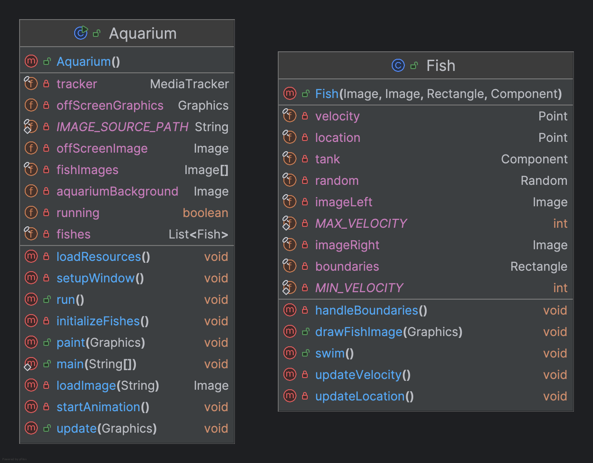
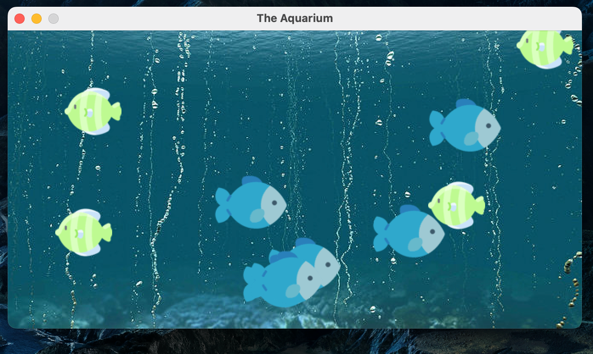

# Project 1: Making Fish Swim in the Multithreaded Aquarium
## 1. About
   _This first project is purely for fun—a working, multithreaded aquarium where the fish actually swim around and bounce off the walls._

## 2. Class diagram: 
   

## 3. Result
   
